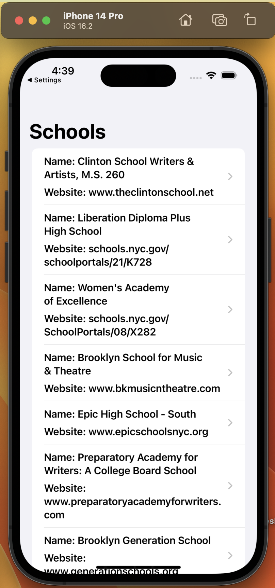
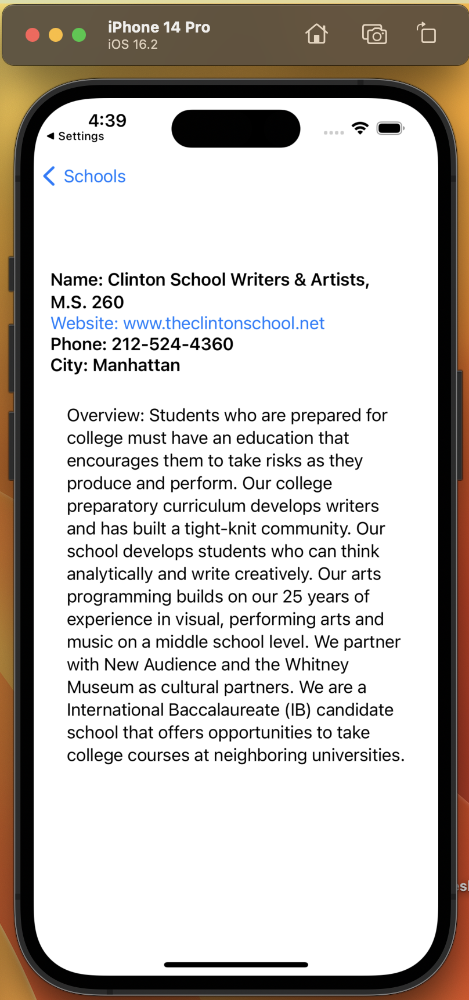
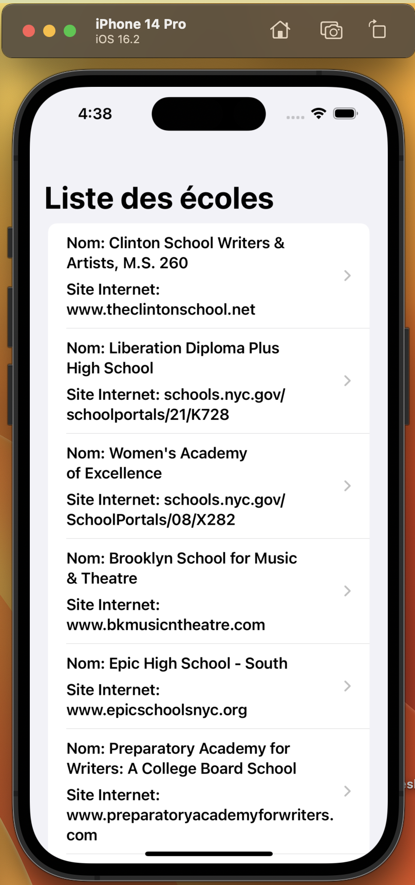
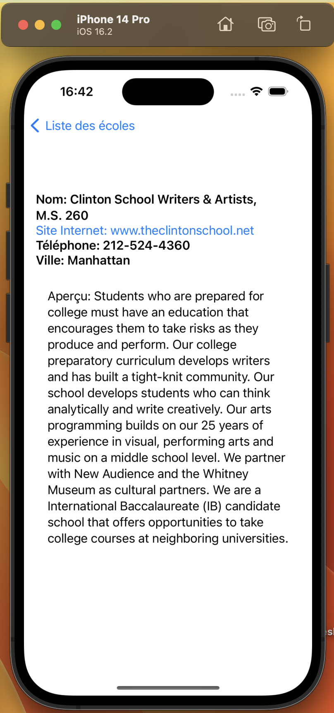
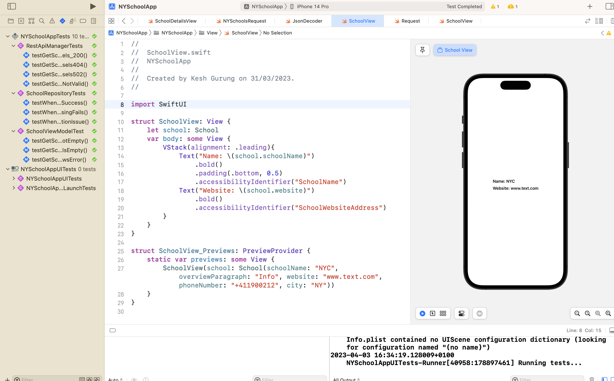

# NYSchoolApp
 -  This is an app that lists all the school in NewYork city and its information using the [NYCity School API](https://data.cityofnewyork.us/resource/s3k6-pzi2.json)

### How to Clone / Open the app

- Goto github link [NYSchool APP](https://github.com/keshgurung/NYSchoolApp)
- Open terminal, select a place to clone the project eg: cd desktop
- Use command ``` git clone https://github.com/keshgurung/NYSchoolApp ``` to clone the project locally.
- Open the project, CLick on the NYSchoolApp.xcodeproj file. The file will open in XCode.
- Goto product menu and select run or simply click on the play button to run the app in simulator.
- To run tests, goto product menu and click on test. All the tests will run on the simulator.

### XCode
- Version: 14.2
- Minimum Deployment: iOS 16 and over

### Architecture and design pattern:
- The app follows Repository Clean Architecture, with dependency injection pattern. 
- All the unit test cases are written using XCTest framework (native iOS).
- Mock and stub technique is used writing the unit test cases in the app to test the network service as well as the view model tests.

### Localisation and identifier
- The app is localised in french language too. The .string file is present in the app for base language(english) and french.
- Accesibility identifiers are added for the list items in the app to make easy for UI testing.

### Screenshots (with localised and base language)

- Main and details screen (english)



- Main and details screen (french)



### Screenshot (Tests XCode)

- Screenchot of all test cases passing

